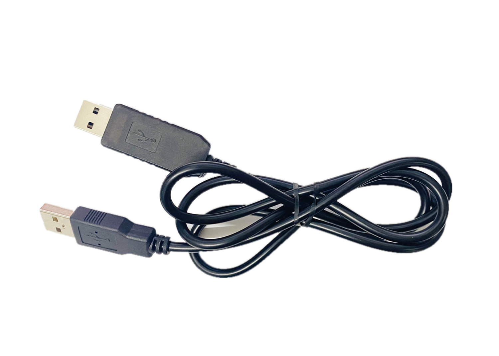
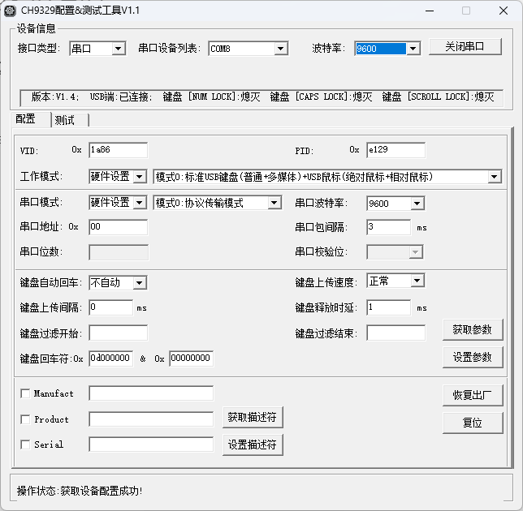

### Hardware Introduction

The CH9329 is a chip that converts serial communication to standard USB HID devices (keyboard, mouse, custom HID). Depending on the operating mode, it can be recognized by a computer as a standard USB keyboard device, USB mouse device, or custom HID class device.



### Configuration Example

For Docker users, CH9329 parameters can be set during deployment via environment variables.

Alternatively, you can replace or add the following configuration in `/etc/kvmd/override.yaml`. The `speed` parameter represents the serial communication speed.

```yaml
kvmd:
    hid:
        type: ch9329
        device: /dev/ttyUSB0
        speed: 9600
        read_timeout: 0.3
```

### Parameter Optimization

You can download the [CH9329 Configuration & Testing Tool](https://www.wch.cn/downloads/CH9329EVT_ZIP.html) to modify the hardware parameters.

Using the provided host software, users can configure the chip's operating mode, serial communication mode, serial communication baud rate, various timeout settings, VID, PID, and various USB string descriptors.

It is recommended that users change the serial communication baud rate from **9600** to **115200** (and also update the CH9329 `speed` parameter in the One-KVM configuration file). This will significantly reduce the CH9329 delay and greatly improve the web remote control experience.

If there is a need for anti-detection, you can also modify the USB device identifiers VID and PID.



